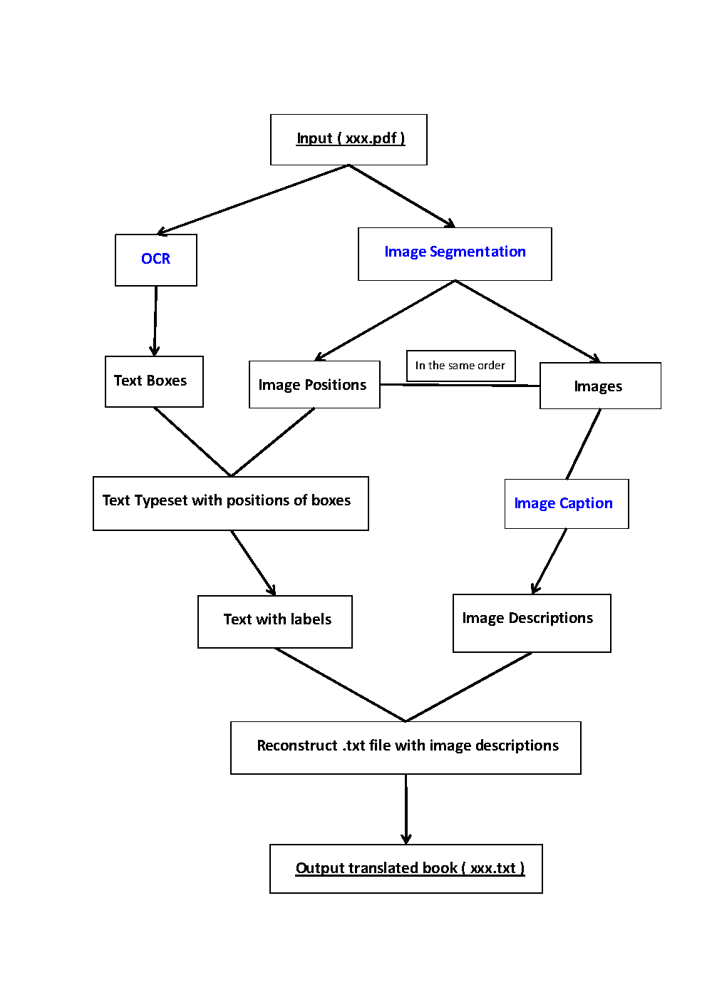

# Translate-books-for-the-visually-impaired
Translate a well-written book for the visually impaired, in which all the pictures have been replaced with valid, appropriate descriptions.

# Requirements
1. Install [PaddleOCR](https://github.com/PaddlePaddle/PaddleOCR), you can see instruction [here](https://github.com/PaddlePaddle/PaddleOCR/blob/release/2.6/doc/doc_ch/environment.md) .

# Project Overview

